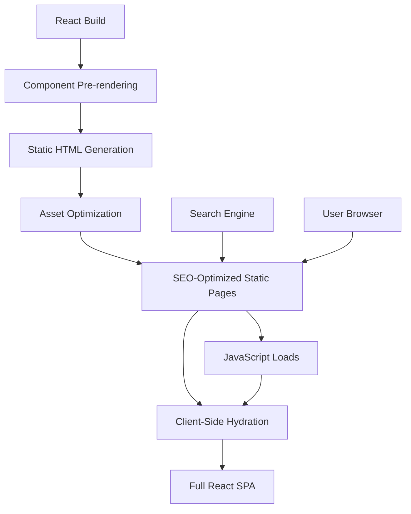

# Design Document

## Overview

The current static page generation system creates HTML files that contain only basic fallback content in `<noscript>` tags, while the actual React SPA content is rendered client-side. This creates a disconnect between what search engines see and what users experience. Since GitHub Pages only serves static files, the solution is to implement build-time pre-rendering by running React components in a Node.js environment during the build process, generating static HTML that matches the React SPA output exactly.

## Architecture

### Current Architecture Issues
- Static pages use basic HTML templates with minimal content
- React SPA renders completely separately from static content
- No shared styling or component structure between static and React versions
- Build process generates duplicate assets in each route directory

### Proposed Architecture
The solution implements a hybrid approach that combines static pre-rendering with client-side hydration:



### Key Design Principles
1. **Component Reuse**: Static pages use the same React components as the SPA
2. **Progressive Enhancement**: Static content works without JavaScript, enhanced with React
3. **SEO Optimization**: Full content and metadata available to crawlers
4. **Performance**: Fast initial load with static content, enhanced interactivity after hydration

## Components and Interfaces

### Static Rendering Engine
A new build-time component that renders React components to static HTML:

```javascript
interface StaticRenderer {
  renderComponent(component: ReactComponent, props: object): string;
  renderPage(route: RouteConfig): StaticPageResult;
  extractAssets(component: ReactComponent): AssetManifest;
}
```

### Route Configuration System
Enhanced route configuration that maps React routes to static generation:

```javascript
interface RouteConfig {
  path: string;
  component: ReactComponent;
  getStaticProps?: () => Promise<object>;
  metadata: SEOMetadata;
  generateSubRoutes?: () => Promise<RouteConfig[]>;
}
```

### Asset Management System
Improved asset handling that ensures proper CSS and JavaScript inclusion:

```javascript
interface AssetManager {
  extractCriticalCSS(component: ReactComponent): string;
  bundleComponentAssets(component: ReactComponent): AssetBundle;
  optimizeAssetLoading(assets: AssetBundle): OptimizedAssets;
}
```

### Hydration Controller
Client-side system that seamlessly transitions from static to dynamic:

```javascript
interface HydrationController {
  detectStaticContent(): boolean;
  hydrateComponent(element: HTMLElement, component: ReactComponent): void;
  preserveUserState(): void;
}
```

## Data Models

### Static Page Configuration
```javascript
interface StaticPageConfig {
  route: string;
  title: string;
  description: string;
  keywords: string[];
  component: string;
  props: Record<string, any>;
  assets: {
    css: string[];
    js: string[];
    images: string[];
  };
  structuredData: object[];
}
```

### Build Manifest
```javascript
interface BuildManifest {
  pages: StaticPageConfig[];
  sharedAssets: AssetBundle;
  buildTimestamp: string;
  version: string;
}
```

### Component Metadata
```javascript
interface ComponentMetadata {
  name: string;
  dependencies: string[];
  criticalCSS: string;
  staticProps: object;
  dynamicFeatures: string[];
}
```

## Error Handling

### Build-Time Error Handling
- **Component Rendering Failures**: Graceful fallback to basic HTML template
- **Asset Resolution Errors**: Warning logs with fallback to default assets
- **Route Generation Failures**: Skip problematic routes, continue with others
- **Data Fetching Errors**: Use cached data or default content

### Runtime Error Handling
- **Hydration Failures**: Maintain static functionality, log errors
- **JavaScript Loading Errors**: Ensure static content remains functional
- **Component Mount Errors**: Fallback to static content for failed components
- **Navigation Errors**: Provide static navigation links as backup

### Error Recovery Strategies
1. **Graceful Degradation**: Always ensure basic functionality works
2. **Progressive Enhancement**: Add features incrementally
3. **Fallback Content**: Maintain meaningful content even when dynamic features fail
4. **Error Boundaries**: Isolate component failures to prevent full page crashes

## Testing Strategy

### Static Generation Testing
- **Component Rendering Tests**: Verify each React component renders to valid HTML
- **Asset Inclusion Tests**: Ensure all required CSS/JS files are properly included
- **SEO Metadata Tests**: Validate meta tags, structured data, and canonical URLs
- **Route Generation Tests**: Confirm all routes generate correct static pages

### Visual Parity Testing
- **Screenshot Comparison**: Compare static vs React-rendered pages visually
- **CSS Consistency Tests**: Verify styling matches between static and dynamic versions
- **Layout Validation**: Ensure responsive design works in both modes
- **Interactive Element Tests**: Confirm buttons, forms, and links work statically

### Performance Testing
- **Load Time Analysis**: Measure static page load times vs SPA load times
- **Core Web Vitals**: Ensure static pages meet performance benchmarks
- **Asset Optimization**: Verify CSS/JS bundles are properly optimized
- **Caching Strategy**: Test static asset caching and invalidation

### SEO Testing
- **Search Engine Simulation**: Test how crawlers see the static content
- **Structured Data Validation**: Verify schema markup is correctly rendered
- **Meta Tag Verification**: Ensure all SEO tags are present and accurate
- **Sitemap Generation**: Confirm sitemap includes all static routes

### Integration Testing
- **Build Process Integration**: Test static generation within existing build pipeline
- **Deployment Testing**: Verify static pages deploy correctly to GitHub Pages
- **Cross-Browser Testing**: Ensure static pages work across different browsers
- **Hydration Testing**: Verify smooth transition from static to dynamic content

### Accessibility Testing
- **Static Accessibility**: Ensure static content meets WCAG guidelines
- **Keyboard Navigation**: Test navigation without JavaScript
- **Screen Reader Compatibility**: Verify static content works with assistive technology
- **Progressive Enhancement**: Confirm accessibility improves with JavaScript enabled